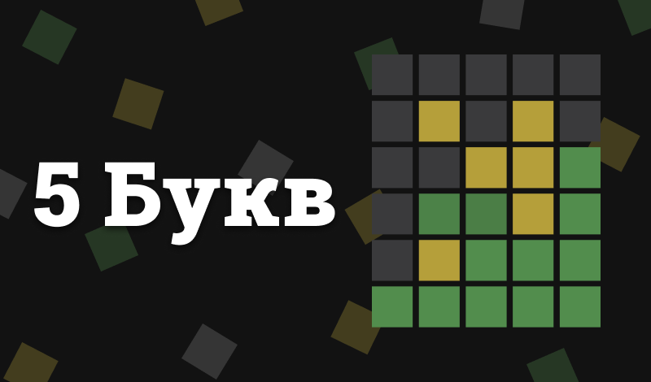
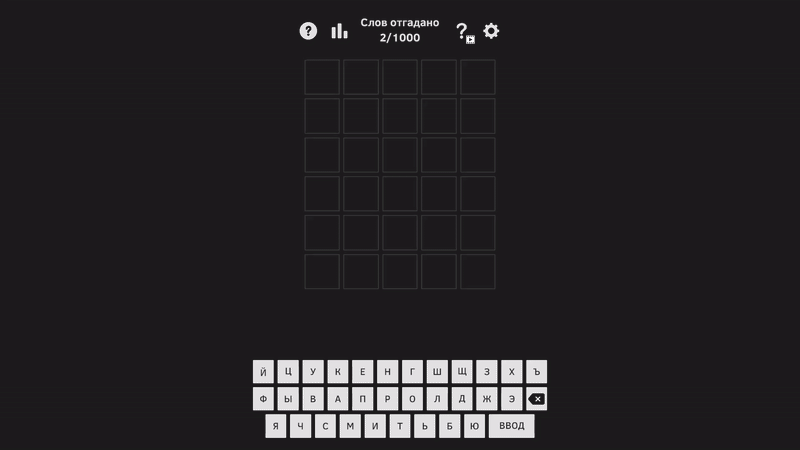

# 🟩 5 Букв

**5 Букв** — это Wordle-подобная игра, в которой игрокам предстоит угадывать слова за ограниченное количество попыток. Игра тренирует логику, память и словарный запас.

## 🔗 Сыграть на Яндекс Играх

👉 [Играть сейчас](https://yandex.ru/games/app/396630?lang=ru)  

## 🖼️ Геймплей

## ⚙️ Инструменты

- **Unity (WebGL)**
- **C#**
- **Zenject**
- **DOTween**
- **PluginYourGames** - для подключения к Яндекс Играм и монетизации
